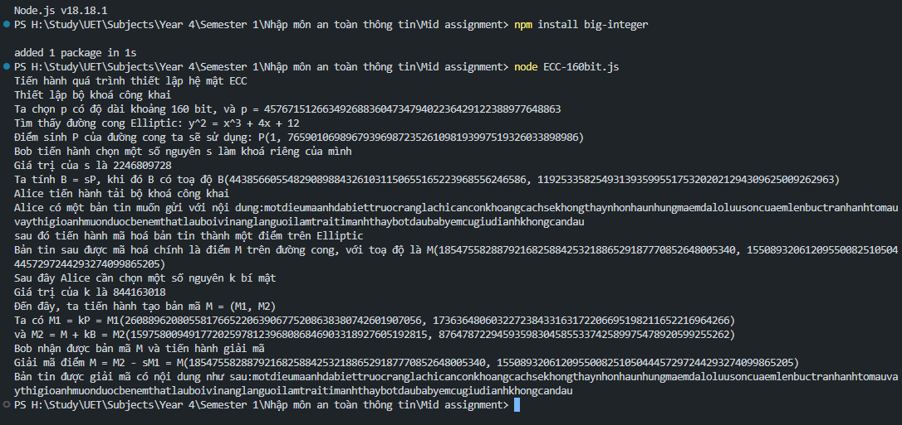

# Midterm-INT3213
Bài tập giữa kỳ, môn học Nhập môn An toàn Thông tin (INT3213 1)

Các bước cài đặt và chạy thử

## Phần mã hoá và giải mã trên đuờng cong Elliptic

Bước 1: cài đặt nodejs tại https://nodejs.org/

Bước 2: Mở terminal

Bước 3: Di chuyển đến thư mục đến thư mục chứa tệp

Bước 4: Tải module big-integer:
'''
npm install big-integer
'''

Bước 5: Tiến hành chạy file: 
'''
node Elliptic-160bits.js
'''

## Phần thiết lập sơ đồ chữ ký trên đường cong Elliptic

Bước 1: cài đặt nodejs tại https://nodejs.org/

Bước 2: Mở terminal

Bước 3: Di chuyển đến thư mục đến thư mục chứa tệp

Bước 4: Tải module big-integer:
'''
npm install big-integer
'''

Bước 5: Tiến hành chạy file: 
'''
node ECC_signature_schema.js
'''
